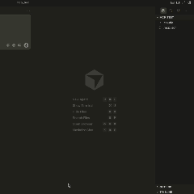

# Cursor History MCP

<p align="center">
  
</p>

[](https://www.npmjs.com/package/cursor-history-mcp)
[](https://www.npmjs.com/package/cursor-history-mcp)
[](https://opensource.org/licenses/MIT)
[](https://nodejs.org/)
[](https://www.typescriptlang.org/)

**MCP server for browsing, searching, exporting, and backing up your Cursor AI chat history.**

Bring your Cursor AI chat history directly into Claude. Search past conversations, export sessions, create backups, and generate year-in-review reports—all through natural language. Built on the [Model Context Protocol](https://modelcontextprotocol.io/) for seamless AI assistant integration.

## Installation

No installation required! Run directly via npx:

```bash
npx cursor-history-mcp
```

## Configuration

### Cursor



### Claude Code

Add to your Claude Code MCP settings:

```json
{
  "mcpServers": {
    "cursor-history": {
      "command": "npx",
      "args": ["-y", "cursor-history-mcp"]
    }
  }
}
```

### Claude Desktop

Add to your Claude Desktop configuration (`~/.claude/claude_desktop_config.json`):

```json
{
  "mcpServers": {
    "cursor-history": {
      "command": "npx",
      "args": ["-y", "cursor-history-mcp"]
    }
  }
}
```

## Available Tools

| Tool | Description |
|------|-------------|
| `cursor_history_list` | List chat sessions with metadata |
| `cursor_history_show` | View full conversation content |
| `cursor_history_search` | Search across all sessions |
| `cursor_history_export` | Export session to Markdown or JSON |
| `cursor_history_backup` | Create backup of all history |
| `cursor_history_restore` | Restore from backup (destructive) |
| `cursor_history_migrate` | Move/copy sessions between workspaces (destructive) |
| `cursor_history_year_pack` | Generate year-in-review data package with stats, topics, and prompt template |

## Usage Examples

After configuring, ask your AI assistant:

- "List my Cursor chat sessions"
- "Show me session #1"
- "Search my Cursor history for 'authentication'"
- "Export session #1 as markdown"
- "Backup my Cursor chat history"

## Requirements

- Node.js 20+
- Cursor IDE installed with existing chat history

## License

MIT
